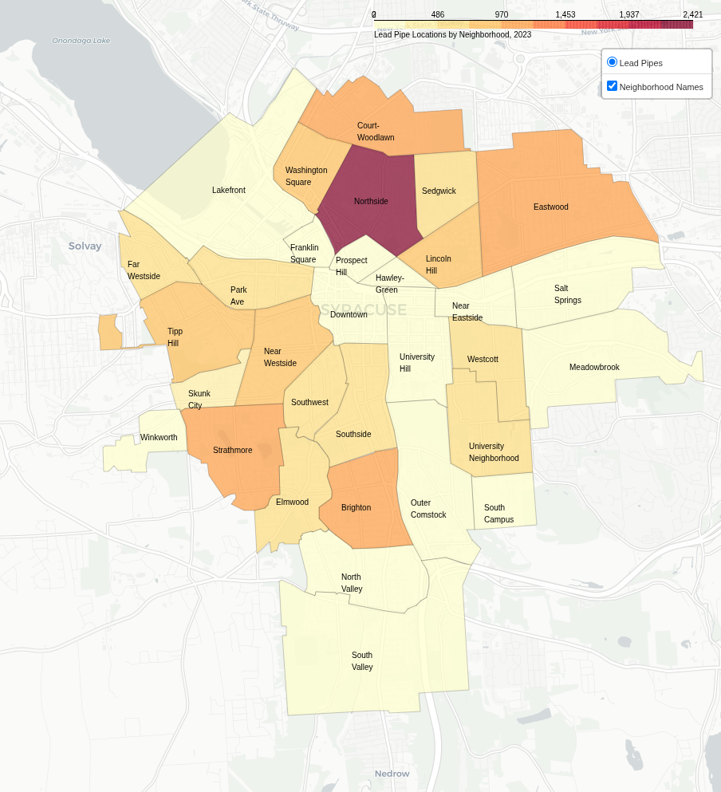

# Syracuse-Open-Data-Day-2024
Source code and assets for our team's submission for the year's theme: "Healthy Housing: Quality, Safety, and Accessibility"

Event Link: [https://data.syr.gov/pages/open-data-day-2024](https://data.syr.gov/pages/open-data-day-2024)

## Submission Summary

### Questions
1. Where is lead exposure most severe in Syracuse?
2. How are racial disparities impacted by lead exposure and testing gaps?
3. What specific actions can reduce lead risks in our most affected communities?

### Why Does This Matter?
1. Lasting health impacts for children.
2. Need for targeted interventions.

### Results
The lead poisoning rates among Black children were much higher when controlling for demographic composition by Zip Code and testing rates between races.

### Limitations
1. Other sources of lead may be the cause of the increased lead poisoning, rather than the pipes themselves, requiring followup studies.
2. Available data on testing rates only has a resolution at the Zip Code level.
3. Available data has very few demographic bins.

### Recommendations
1. Replace lead feeder pipes, beginning in the higher risk neighborhoods.
2. Increase testing availability.
3. Partner with local groups to increase awareness through community education.
4. Increase data transparency.

### Lead Pipes by Neighborhood
Further analysis of the prevalence of lead pipes revealed a significant concentration in the North Side Neighborhood.

